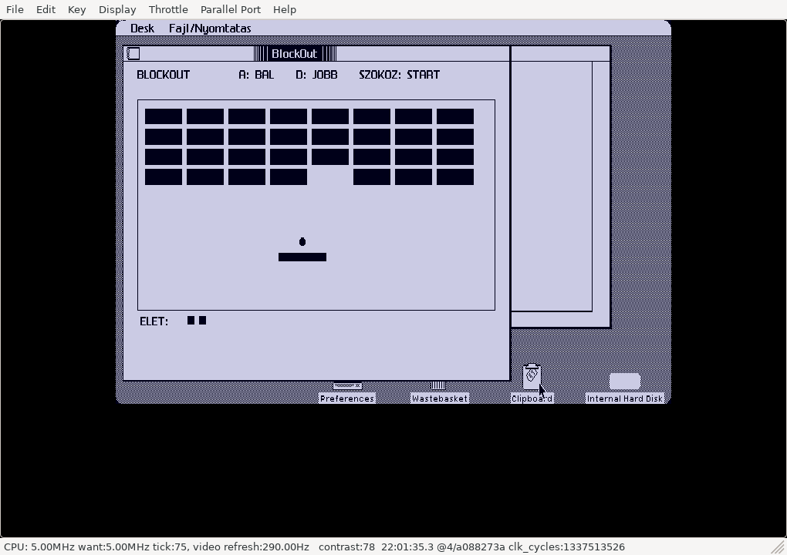

# BlockOut for Apple Lisa 2

**Native game for real Apple Lisa 2 hardware running Lisa Office System 3,
including Lisa 2/5 and Lisa 2/10.** The release contains a native Motorola
68000 LOS application. LisaEm is also supported.

Hungarian brick breaker for Apple Lisa, running in a window under
Lisa Office System 3. Move the paddle with **A / D** (also J / L); **Space**
launches the ball. Break the bricks and keep the ball in play.

## Download and run

Download **[dist/BlockOut.dc42](dist/BlockOut.dc42)** (use GitHub's Download raw
file button), or get the floppy from this repository's Releases page.
The image is a 400 KB tagged Lisa floppy in Disk Copy 4.2 format: **419,284
bytes**. It is an application floppy, not a boot disk.

### Real Apple Lisa 2

1. Boot Lisa Office System 3 on your Apple Lisa 2.
2. Write `BlockOut.dc42` to a Lisa-format **400 KB 3.5-inch floppy** using a compatible
   disk-image writer and drive. Preserve the native Lisa sector tags in the DC42
   image when writing it. You may also use a floppy replacement that supports
   native Lisa disk images.
3. Insert the prepared floppy into the Lisa, open its disk window, select the
   game tool and choose **File/Print → Open**.
4. To install on your hard disk, use LOS **Duplicate**, then drag the duplicate
   to your Games folder. Keep the floppy inserted until copying completes;
   allow LOS to close the running tool if requested.

The DC42 download is a complete disk image: write it as a disk, rather than
copying the `.dc42` file onto a formatted floppy. Its native Lisa tags are part
of the image. For background on Lisa 2 disk media, see the
[Lisa hardware FAQ](https://lisafaq.sunder.net/lisafaq-hw-media-floppy_wheretobuy.html)
and [Lisa filesystem documentation](https://sunder.net/lisafsh/index.html).

### LisaEm

1. Boot your own Lisa Office System 3 installation in LisaEm.
2. Insert/mount `BlockOut.dc42` as the floppy disk.
3. Open the disk, select the game tool and choose **File/Print → Open**.
4. Use LOS **Duplicate** to install it on the emulated hard disk, keeping the
   floppy inserted until copying completes.

The recorded release tests were performed in LisaEm; a physical Lisa 2 test
has not yet been recorded. See [VALIDATION.md](VALIDATION.md) for the evidence.

The floppy exposes one game tool; LOS support resources are hidden files.
The application has its own tool number **240**, icon and volume identity,
so it can coexist with Minesweeper and the other game. LOS permits only one
copy of the same tool per disk; replace an older version of this same game
before copying another one onto that disk.

## Source and build

- `src/M.TEXT`: final main Pascal source used for the released program.
- `src/G.TEXT`, `J.TEXT`, `D.TEXT`, `I.TEXT`: required supporting units.
- `src/A.TEXT`: alert/phrase resource source.
- [BUILD.md](BUILD.md): compiler requirements and rebuild instructions.
- [VALIDATION.md](VALIDATION.md): recorded native and host validation.
- [CREDITS.md](CREDITS.md): upstream application framework and source provenance.

This repository publishes the corrected **2026-10-06** disk image. Earlier
prototype images with conflicting tool identities or damaged page links are
not release downloads.

SHA-256: `43b9a4a02d1369a5a5e11d519dd743aa64703466853c6a57c0ffdaa818b447ad`.
